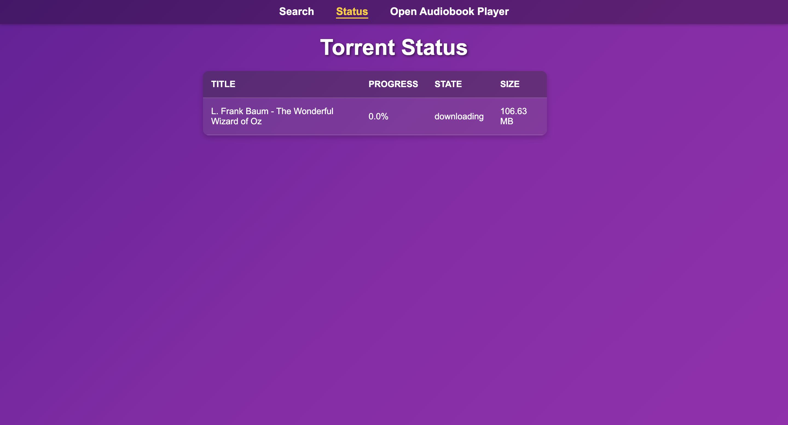

<!-- File: README.md -->

# AudiobookBay Automated

AudiobookBay Automated is a lightweight web application designed to simplify audiobook management. It allows users to
search [**AudioBook Bay**](https://audiobookbay.lu/) for audiobooks and send magnet links directly to a designated
**Deluge, qBittorrent or Transmission** client.

## How It Works

- **Search Results**: Users search for audiobooks. The app grabs results from AudioBook Bay and displays results with
  the **title** and **cover image**, along with two action links:
  1. **More Details**: Opens the audiobook's page on AudioBook Bay for additional information.
  2. **Download to Server**: Sends the audiobook to your configured torrent client for downloading.

- **Magnet Link Generation**: When a user selects "Download to Server," the app generates a magnet link from the
  infohash displayed on AudioBook Bay and sends it to the torrent client. Along with the magnet link, the app assigns:
  - A **category label** for organizational purposes.
  - A **save location** for downloaded files.

> **Note**: This app does not download or move any material itself (including torrent files). It only searches AudioBook
> Bay and facilitates magnet link generation for the torrent client.

## Features

- **Search Audiobook Bay**: Easily search for audiobooks by title or keywords.
- **Private Details View**: Browse book descriptions, file sizes, and tracker info internally. The app acts as a proxy,
  ensuring your IP address is never exposed to AudiobookBay while browsing.
- **Basic Download Status Page**: Monitor the download status of items in your torrent client that share the specified
  category assigned.
- **No AudioBook Bay Account Needed**: The app automatically generates magnet links from the displayed infohashes and
  pushes them to your torrent client for downloading.
- **Automatic Folder Organization**: Once the download is complete, the torrent client will automatically move the
  downloaded audiobook files to your save location. Audiobooks are organized into subfolders named after the AudioBook
  Bay title, making it easy for [**Audiobookshelf**](https://www.audiobookshelf.org/) to automatically add completed
  downloads to its library.
- **Audiobookshelf Integration**: (Optional) Automatically trigger a library scan in Audiobookshelf via a button in the
  UI.

## Why Use This?

AudiobookBay Automated provides a simple and user-friendly interface for users to download audiobooks without searching
on their own and import them into your library.

---

## Installation

### Prerequisites

- **Deluge, qBittorrent or Transmission** (with the WebUI enabled)
- **Docker** (optional, for containerized deployments)
- **Python 3.11 - 3.14** (for local execution)

> **Important for Deluge Users**: It is **strongly recommended** to enable the **Label** plugin in your Deluge client
> (WebUI or GTK). This app uses the plugin to categorize downloads. If the plugin is missing or disabled, the app will
> still function and add downloads, but they will **not be categorized**, and the "Status" page may not be able to track
> them effectively. Transmission and qBittorrent support categorization natively without plugins.

### Environment Variables

The app uses environment variables to configure its behavior.

#### 1. Torrent Client Connection (Required)

> **Note:** For some unknown reason some users have issues if the hostname is quoted, if it doesn't work try removing
> the quotes. I have no idea why this happens and can only assume it depends on the host system and how it handles
> envs/DNS lookup.

```env
DL_CLIENT=qbittorrent          # Options: qbittorrent, transmission, deluge
DL_HOST=192.168.1.123          # IP/Hostname of your client
DL_PORT=8080                   # WebUI Port
DL_USERNAME=admin              # WebUI Username
DL_PASSWORD=password           # WebUI Password
DL_SCHEME=http                 # Protocol (http or https). Default: http.
DL_CATEGORY=abb-automated      # Category to assign to torrents. Default: abb-automated.
```

#### 2. System Configuration (Required)

```env
SAVE_PATH_BASE=/audiobooks     # CRITICAL: The root save path *inside* the Torrent Client container.
SECRET_KEY=change_me           # Flask Session Key. Change this for production security.
```

#### 3. Audiobookshelf Integration (Optional)

To enable the "Reload Library" button in the navigation bar:

```env
ABS_URL=http://192.168.1.123:13378 # URL to your Audiobookshelf instance
ABS_KEY=your_api_token             # API Token (Settings -> Users)
ABS_LIB=your_library_id            # Library ID (Found in the URL when viewing the library)
```

#### 4. Search & Scraping (Optional)

```env
ABB_HOSTNAME=audiobookbay.lu   # Primary mirror. Default: audiobookbay.lu
ABB_MIRRORS=audiobookbay.is,audiobookbay.se       # Comma-separated list of backup mirrors to try.
MAGNET_TRACKERS=udp://...      # Comma-separated list of extra trackers to add to magnets.
PAGE_LIMIT=3                   # Max pages to scrape per search. Default: 3.
```

#### 5. Application Settings (Optional)

```env
LISTEN_PORT=5078               # Internal port. Default: 5078.
LISTEN_HOST=0.0.0.0            # Bind address. Default: 0.0.0.0 (or [::] if IPv6 detected).
THREADS=8                      # Worker threads. Increase for higher concurrency. Default: 8.
SCRAPER_THREADS=3              # Number of concurrent scraping requests. Default: 3.
TIMEOUT=60                     # Request timeout in seconds. Default: 60.
LOG_LEVEL=INFO                 # Logging verbosity: DEBUG, INFO, WARNING, ERROR. Default: INFO.
TZ=UTC                         # Timezone for logs (e.g. America/Los_Angeles). Default: UTC.
NAV_LINK_NAME=Open Player      # Label for a custom link in the navbar.
NAV_LINK_URL=http://...        # URL for the custom link.
```

### Using Docker

1. Use `docker-compose` for quick deployment. You can find ready-to-use templates in the [`examples/`](examples/)
   directory.
   - **Recommended:** [`examples/docker-compose.yaml`](examples/docker-compose.yaml) (Uses a `.env` file for security)
   - **Alternative:** [`examples/docker-compose.no-env.yaml`](examples/docker-compose.no-env.yaml) (Hardcoded
     configuration)

   Download the example file to your server (e.g., using `wget` or `curl`) and rename it to `docker-compose.yml`.

2. **Start the Application**:

   ```bash
   docker-compose up -d
   ```

### Running Locally

1. **Install Dependencies**: Ensure you have **Python 3.11+** installed (3.14 recommended), then install the required
   dependencies:

   ```bash
   # Install from pyproject.toml
   pip install .
   ```

2. **Configure Environment**: Copy the example environment file to `.env`:

   ```bash
   cp examples/.env.example .env
   ```

### Advanced: Custom Trackers

If you wish to supply a long list of trackers that exceeds environment variable limits, you can mount a JSON file to
`/app/trackers.json` inside the container.

1. Create a `trackers.json` file. See [`examples/trackers.json`](examples/trackers.json) for the required format.
2. Update your `docker-compose.yaml` to include the volume mount:

```yaml
volumes:
  - ./trackers.json:/app/trackers.json:ro
```

The application will automatically detect this file and prioritize it over the default tracker list.

---

## Notes

- **This app does NOT download any material**: It simply generates magnet links and sends them to your configured
  torrent client for handling.

- **Folder Mapping**: **The `SAVE_PATH_BASE` is based on the perspective of your torrent client**, not this app. This
  app does not move any files; all file handling and organization are managed by the torrent client. Ensure that the
  `SAVE_PATH_BASE` in your torrent client aligns with your audiobook library (e.g., for Audiobookshelf). Using a path
  relative to where this app is running, instead of the torrent client, will cause issues.

---

## Feedback and Contributions

This project is production-ready, but your feedback is always welcome! Feel free to open issues or contribute by
submitting pull requests.

**Developers:** Please review [`AGENTS.md`](AGENTS.md) for strict architectural rules and coding standards before
contributing.

---

## Screenshots

### Search Page


### Details Page


### Status Page



---
